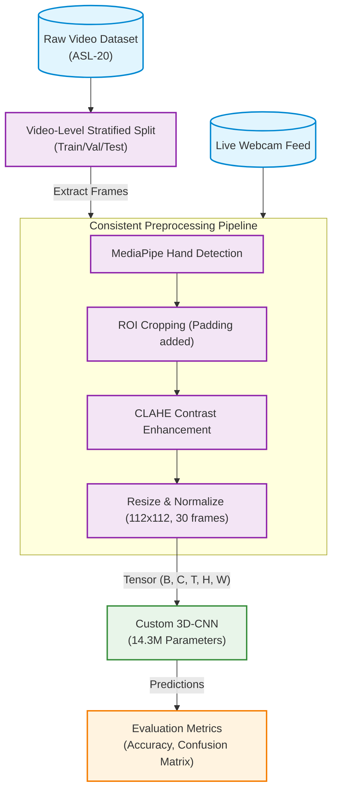

# Sign Language Recognition (SLR)

This repository contains a complete pipeline for Sign Language Recognition, capable of classifying 20 ASL gestures using a custom 3D Convolutional Neural Network (3D-CNN) that achieved **90.71% validation accuracy**.

The pipeline is built with a focus on real-time application, utilizing MediaPipe for dynamic hand region-of-interest (ROI) extraction and CLAHE for contrast enhancement before feeding a spatio-temporal tensor into the 3D-CNN.

## Features

- **Custom 14.3M parameter 3D-CNN**: Designed specifically for spatio-temporal gesture recognition.
- **Robust Preprocessing Pipeline**: MediaPipe hand detection → Dynamic ROI cropping → CLAHE enhancement → Normalized tensor.
- **Real-time Inference Application**: A fully functional webcam script (`realtime_inference.py`) that uses the exact same preprocessing pipeline as training to ensure zero domain shift.
- **Strict Anti-Leakage Evaluation**: Video-level dataset splitting guarantees that frames from the same video never appear in both training and test sets.
- **Modular Architectures**: Includes implementations of various model families (2D CNNs, CNN+LSTM, Transformers, ST-GCN, Traditional CV) for comparison and research purposes.

## Pipeline Architecture

The following flowchart illustrates the step-by-step pipeline used for both training the 3D-CNN and running real-time inference.



## Repository Structure

```text
watermark-embedding-system/
├── data/
│   ├── raw/                    # Original, immutable datasets
│   ├── processed/              # Cleaned/preprocessed datasets
│   ├── train/                  # Training split
│   ├── val/                    # Validation split
│   └── test/                   # Test split
├── notebooks/                  
│   ├── 1.0-hog-svm-baseline.ipynb # HOG+SVM Baseline
│   └── 2.0-3dcnn-mediapipe.ipynb  # 3D CNN implementation
├── checkpoints/                # Saved model weights (.pth)
├── logs/                       # Training logs
├── results/                    
│   ├── figures/                # Output plots and confusion matrices
│   └── metrics/                # JSON metrics and evaluation reports
├── models/                     # Architectures (2D CNN, Sequence, Spatiotemporal, Transformers, Keypoint)
├── realtime_inference.py       # Live webcam inference script
├── train.py                    # Main training script for the 3D-CNN
├── evaluate_checkpoint.py      # Script to evaluate a saved checkpoint on the test set
├── preprocessing.py            # MediaPipe + CLAHE video processing logic
├── dataset.py                  # PyTorch Dataset for loading video tensors
├── utils_video.py              # Frame extraction and dataset splitting utilities
├── baseline_hog_svm.py         # Script to run the HOG+SVM traditional baseline
├── compare_models.py           # Utility to compare metrics across different runs
├── config_template.yaml        # Configuration file for experiments
└── requirements.txt            # Dependency list
```

## Setup & Installation

1. Clone the repository and install the requirements:
   ```bash
   pip install -r requirements.txt
   ```
2. Download your dataset (e.g., `ASL-20-Words-Dataset-V1`) and place it in `data/raw/`.
3. Extract it so that each class has its own folder (e.g., `data/raw/class_name/video.mp4`).

## Usage

### 1. Training the 3D-CNN

To train the 3D-CNN model on your dataset:

```bash
python train.py \
    --dataset_root ./data/raw/Full\ Data \
    --output_dir ./checkpoints \
    --epochs 50 \
    --batch_size 8 \
    --lr 0.001
```

### 2. Evaluating a Checkpoint

To evaluate a trained model and generate a confusion matrix:

```bash
python evaluate_checkpoint.py \
    --checkpoint ./checkpoints/best_model.pth \
    --dataset_root ./data/raw/Full\ Data \
    --output_dir ./results/metrics
```

### 3. Real-time Inference (Webcam)

Run the real-time recognition demo using your webcam:

```bash
python realtime_inference.py \
    --checkpoint ./checkpoints/best_model.pth \
    --camera 0 \
    --threshold 0.6
```

### 4. Running the HOG+SVM Baseline

To compare against a traditional computer vision approach:

```bash
python baseline_hog_svm.py \
    --dataset_root ./data/raw/Full\ Data \
    --output_dir ./results/baseline \
    --kernel linear
```

## Acknowledgements

This project was built as part of an M.Sc. thesis/tutorial on Sign Language Recognition, covering the spectrum from traditional HOG+SVM to state-of-the-art Transformers and ST-GCNs.
